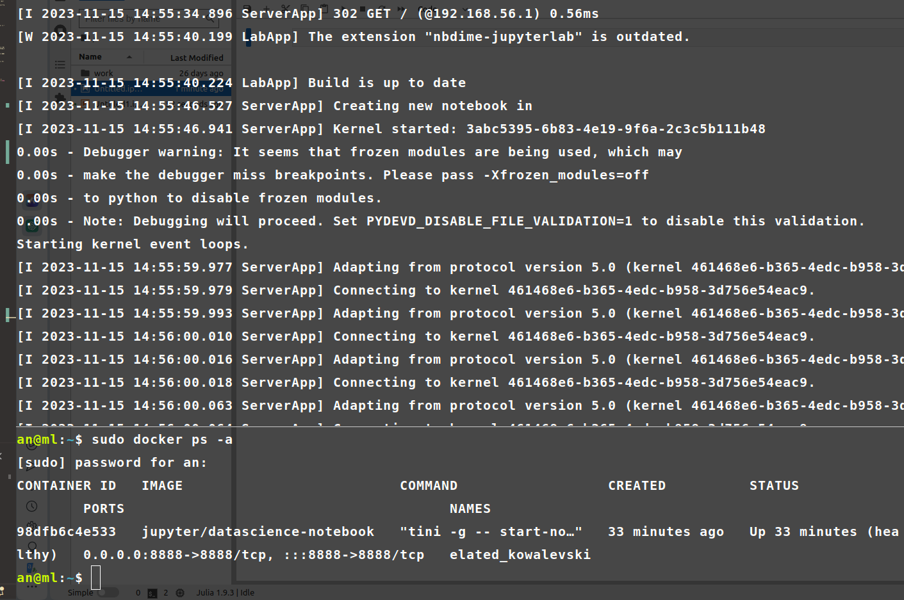

# mlops4
Для 4 ДЗ по MLOps

_Цель эксперимента:_ Улучшить навыки работы с MLOps элементами, продумывания архитектуры проекта, работа с библиотеками машинного обучения, сравнение результатов предобработки данных. 

_Выводы:_  
Связку MLflow с Aiflow, считаю для повседневных задач и экспериментов не подходит, слишком трудоемкий процесс получается для разбиения на этапы.
С типом файла .parquet не так просто работать, вне рамок big data и ds.
С Mlflow нужно научиться работать правильно, иначе это только ухудшит процесс создания модели нужного качества.  

**Стек**  
MLflow  https://mlflow.org/  
Airflow  https://airflow.apache.org/  
VSCode подключенный к виртуальной машине по SSH по ssh  https://code.visualstudio.com/    
Ubuntu Server развёрнутая на виртуальной машине https://ubuntu.com/download/server  
Oracle VirtualBox https://www.virtualbox.org/  
Модель: CatBoost https://catboost.ai/   https://github.com/catboost  
sktime https://github.com/sktime/sktime  
docker https://www.docker.com/  https://hub.docker.com/  
Jupiter Lab (в docker'е) https://jupyter.org/ https://hub.docker.com/r/jupyter/datascience-notebook

 _В планах(не выполненно ещё)_  
Ambrosia https://github.com/MobileTeleSystems/Ambrosia    
etna https://github.com/tinkoff-ai/etna  

Данные были предоставлены для соревнований:  
TGT https://tgtdiagnostics.com/ru/ #лабораторные  
GPN https://gpn-trade.ru/ #синтетические

---
**Пометки:**  
---  

**MLflow**  
mlflow.set_tracking_uri("http://localhost:5000") прописывается 
в случае когда MLflow установлена на локальной системе,
если MLflow установлена в виртуальной машине тогда http://0.0.0.0:5000  

В MLflow эксперимент (mlflow.set_experiment("test_model"))— это именованная коллекция прогонов (отдельное выполнение модели машинного обучения). Поэтому на каждый процесс её применять не надо(как это сделано в The_Main_Refuge_of_Hope), только для финального обучения модели и получения метрик.

**Airflow**  
надо или специально переносить папку с dag'ами в репозиторий, или учитывать, дублировать dag из системной папки airflow в репозиторий (устанавливать airflow в репозиторий очень плохая идея)

**.parquet**   https://parquet.apache.org/  
хороший, но очень специфичный формат, как только ты выходишь за рамки ds,
то сразу появляются проблемы(многие библиотеки не умеют с ним работать)  
он сложен для частичной потоковой передачи данных и имеет сильную привязку к метаданным(теряет информацию при их повреждении)

**DataSpell от JetBrains**
тот же самый Jupiter Notebook, только с функционалом присущий IDE JetBrains(много тем, автоимпорт, TODO и прочее). В том числе и минусами: нужно привыкать, настраивать и разбираться перед первым проектом, сворачивание ячеек как в google colab не реализовано. Бесплатной версии нет. Только демоверсия на 30 дней за электронную почту.
  
  **Ambrosia**  
На python выше 3.8.16 не устанавливается.

**Jupiter Notebook в docker**  
нужно не только при запуске правильно настроить соединение с папкой вне docker, но и всегда сохранять ноутбуки перед остановкой контейнера

**Скриншоты**
**Рабочий терминал подлюченный к VM с запущенным Airflow и MLflow**

**VSСode подключенный к виртуальной машине по ssh**

**Ubuntu Server запущенный на виртуальной машине**

**Oracle VM с запущенной машиной**

**Запущенный airflow в окне браузера с двумя ацикличными графами**

**Запущенный Mlflow, на которм мы видим как ошибочно решение прописывать set_experiment в каждый процесс**

**Запущенный Jupiter Lab развернутый в docker контейнере**

